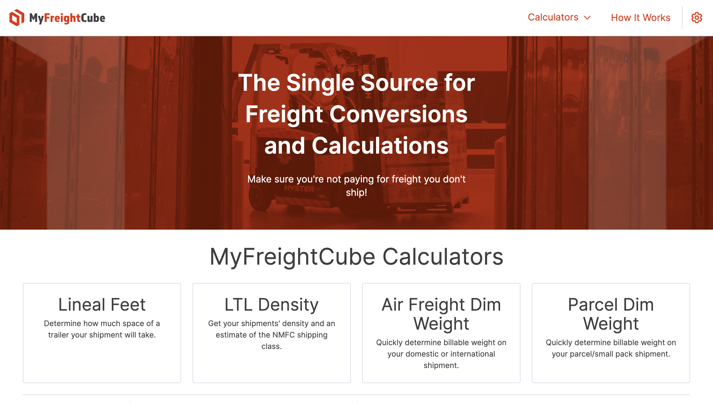
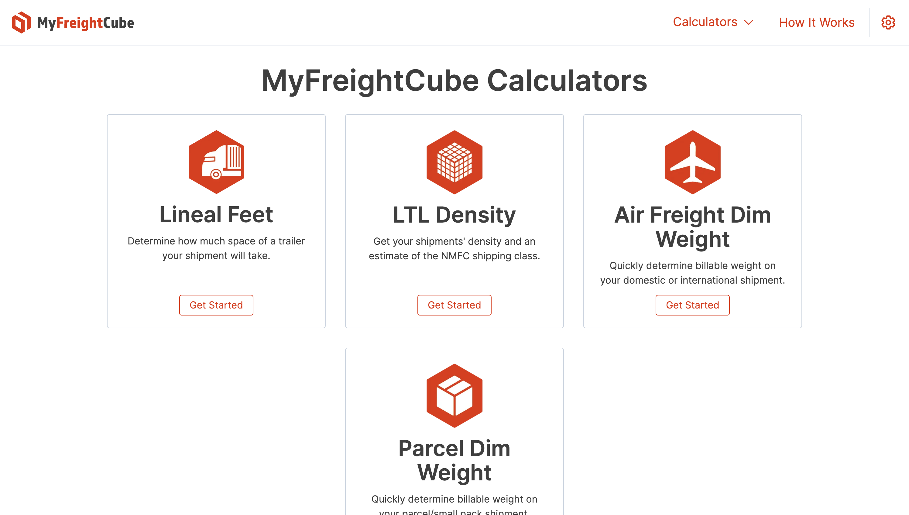
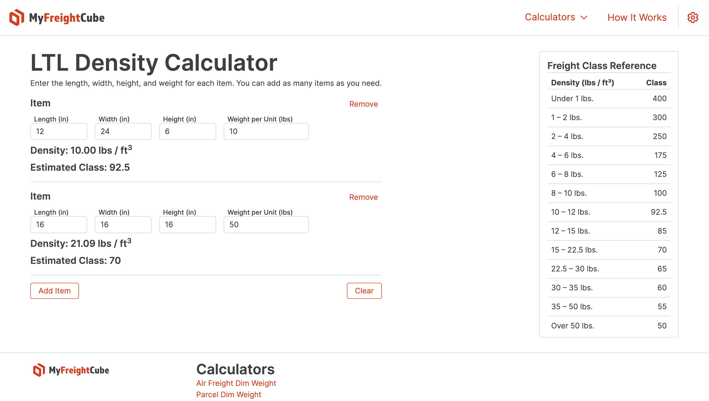

## What is [MyFreightCube](https://fletcheaston.com/my-freight-cube)?

MyFreightCube is a set of calculators to help with common shipping/freight calculations.

<figure markdown>
  
  <figcaption>MyFreightCube Home</figcaption>
</figure>

<figure markdown>
  
  <figcaption>MyFreightCube Calculators</figcaption>
</figure>

<figure markdown>
  
  <figcaption>MyFreightCube LTL Density Calculator</figcaption>
</figure>

## Background

MyFreightCube was originally a contracted project built for [4WL Consulting](https://4wlconsulting.com/) in late 2020/early 2021.
The project was built by Coalesce Software Solutions, a (now dissolved) company that my partner ([Sam Rogers](https://www.linkedin.com/in/samrogers27/)) and I ran.

MyFreightCube, the legal/business entity, was dissolved in 2022 and this project eventually fell into disrepair.
In late 2023, I decided to rebuild the project from scratch.

## Technologies

### Original Project (2020/2021)

- [Django](https://www.djangoproject.com/)
- [Jinja2](https://jinja.palletsprojects.com/en/3.1.x/)
- [Bootstrap](https://getbootstrap.com/)
- [JQuery](https://jquery.com/)
- [Stripe](https://stripe.com/)
- [Cloud SQL for PostgreSQL](https://cloud.google.com/sql/docs/postgres)

The original project stored all data server-side in a Postgres database.
Typical web-app services were included, such as account management and billing.
All pages were rendered server-side using Django and Jinja2 templates with Bootstrap components.

### Rebuilt Project (2023)

- [NextJS](https://nextjs.org/)
- [Tailwind CSS](https://tailwindcss.com/)
- [Dexie.js](https://dexie.org/)

The rebuilt project stores all data client-side in IndexedDB.
There are no accounts and all of the calculators are available to use for free.
There's effectively no real backend (excluding some basic infrastructure).
