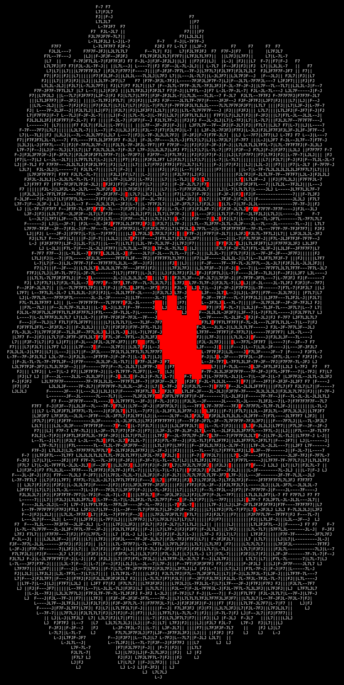
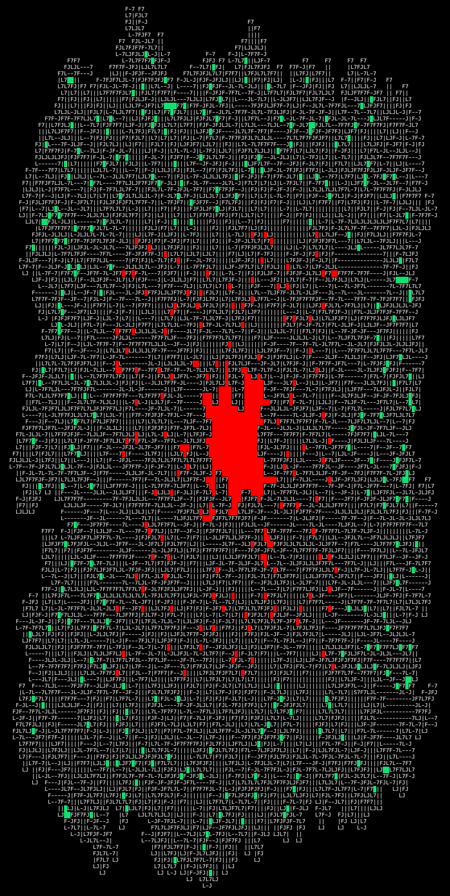

# Day 10: Pipe Maze

## Part 1

### Prompt

You use the hang glider to ride the hot air from Desert Island all the way up to the floating metal island.
This island is surprisingly cold and there definitely aren't any thermals to glide on, so you leave your hang glider behind.

You wander around for a while, but you don't find any people or animals.
However, you do occasionally find signposts labeled "Hot Springs" pointing in a seemingly consistent direction; maybe you can find someone at the hot springs and ask them where the desert-machine parts are made.

The landscape here is alien; even the flowers and trees are made of metal.
As you stop to admire some metal grass, you notice something metallic scurry away in your peripheral vision and jump into a big pipe!
It didn't look like any animal you've ever seen; if you want a better look, you'll need to get ahead of it.

Scanning the area, you discover that the entire field you're standing on is densely packed with pipes; it was hard to tell at first because they're the same metallic silver color as the "ground".
You make a quick sketch of all of the surface pipes you can see (your puzzle input).

The pipes are arranged in a two-dimensional grid of **tiles**:

- `|` is a **vertical pipe** connecting north and south.
- `-` is a **horizontal pipe** connecting east and west.
- `L` is a **90-degree bend** connecting north and east.
- `J` is a **90-degree bend** connecting north and west.
- `7` is a **90-degree bend** connecting south and west.
- `F` is a **90-degree bend** connecting south and east.
- `.` is **ground**; there is no pipe in this tile.
- `S` is the **starting position** of the animal; there is a pipe on this tile, but your sketch doesn't show what shape the pipe has.

Based on the acoustics of the animal's scurrying, you're confident the pipe that contains the animal is **one large, continuous loop**.

For example, here is a square loop of pipe:

```
.....
.F-7.
.|.|.
.L-J.
.....
```

If the animal had entered this loop in the northwest corner, the sketch would instead look like this:

```
.....
.S-7.
.|.|.
.L-J.
.....
```

In the above diagram, the S tile is still a 90-degree `F` bend: you can tell because of how the adjacent pipes connect to it.

Unfortunately, there are also many pipes that **aren't connected to the loop**!
This sketch shows the same loop as above:

```
-L|F7
7S-7|
L|7||
-L-J|
L|-JF
```

In the above diagram, you can still figure out which pipes form the main loop: they're the ones connected to S, pipes **those** pipes connect to, pipes those pipes connect to, and so on.
Every pipe in the main loop connects to its two neighbors (including S, which will have exactly two pipes connecting to it, and which is assumed to connect back to those two pipes).

Here is a sketch that contains a slightly more complex main loop:

```
..F7.
.FJ|.
SJ.L7
|F--J
LJ...
```

Here's the same example sketch with the extra, non-main-loop pipe tiles also shown:

```
7-F7-
.FJ|7
SJLL7
|F--J
LJ.LJ
```

If you want to **get out ahead of the animal**, you should find the tile in the loop that is **farthest** from the starting position.
Because the animal is in the pipe, it doesn't make sense to measure this by direct distance.
Instead, you need to find the tile that would take the longest number of steps **along the loop** to reach from the starting point - regardless of which way around the loop the animal went.

In the first example with the square loop:

```
.....
.S-7.
.|.|.
.L-J.
.....
```

You can count the distance each tile in the loop is from the starting point like this:

```
.....
.012.
.1.3.
.234.
.....
```

In this example, the farthest point from the start is 4 steps away.

Here's the more complex loop again:

```
..F7.
.FJ|.
SJ.L7
|F--J
LJ...
```

Here are the distances for each tile on that loop:

```
..45.
.236.
01.78
14567
23...
```

Find the single giant loop starting at `S`.
**How many steps along the loop does it take to get from the starting position to the point farthest from the starting position?**

### Solution

1. Find the start position
2. Find connected pipe to the start position
3. Follow the pipe until we get back to the start position, counting the number of tiles in the pipe as we go
    - This makes heavy usage of the `OFFSET_MAP`
4. Return the `length of the pipe / 2`

??? question "Why `length of the pipe / 2`?"

    Because the pipe always connects back to the start position, it must always have an even number of segments.
    
    Don't believe me?
    Try to draw a continuous pipe with an odd number of seconds.

```python
from dataclasses import dataclass

from fastapi import APIRouter, Body

router = APIRouter(tags=["2023 - Day 10: Title"])


DOCUMENT_EXAMPLE = [
    "..F7.",
    ".FJ|.",
    "SJ.L7",
    "|F--J",
    "LJ...",
]


@dataclass
class Position:
    x: int
    y: int


# (character, x-offset, y-offset) -> (x-offset, y-offset)
OFFSET_MAP: dict[tuple[str, int, int], Position] = {
    ("|", 0, 1): Position(x=0, y=1),
    ("|", 0, -1): Position(x=0, y=-1),
    ("-", 1, 0): Position(x=1, y=0),
    ("-", -1, 0): Position(x=-1, y=0),
    ("L", 0, 1): Position(x=1, y=0),
    ("L", -1, 0): Position(x=0, y=-1),
    ("J", 1, 0): Position(x=0, y=-1),
    ("J", 0, 1): Position(x=-1, y=0),
    ("7", 1, 0): Position(x=0, y=1),
    ("7", 0, -1): Position(x=-1, y=0),
    ("F", -1, 0): Position(x=0, y=1),
    ("F", 0, -1): Position(x=1, y=0),
}


@dataclass
class Map:
    start: Position
    current: Position

    characters: list[list[str]]

    def get_character(self, x: int, y: int) -> str | None:
        if 0 <= x < len(self.characters[0]) and 0 <= y <= len(self.characters):
            return self.characters[y][x]

        return None

    def run(self) -> int:
        steps = 0

        # Move one position manually
        next_offset: Position | None = None

        for x_offset, y_offset in [(0, 1), (0, -1), (1, 0), (-1, 0)]:
            next_character = self.get_character(
                x=self.current.x + x_offset,
                y=self.current.y + y_offset,
            )

            if OFFSET_MAP.get((next_character, x_offset, y_offset)):
                next_offset = OFFSET_MAP[(next_character, x_offset, y_offset)]
                self.current = Position(
                    x=self.current.x + x_offset, y=self.current.y + y_offset
                )

                steps += 1

                break

        while self.current != self.start:
            # Get the character at the next position
            next_character = self.get_character(
                x=self.current.x + next_offset.x,
                y=self.current.y + next_offset.y,
            )

            self.current = Position(
                x=self.current.x + next_offset.x, y=self.current.y + next_offset.y
            )

            steps += 1

            next_offset = OFFSET_MAP.get((next_character, next_offset.x, next_offset.y))

        return steps // 2


@router.post("/part-1")
async def year_2023_day_10_part_1(
    document: list[str] = Body(
        ...,
        embed=True,
        examples=[DOCUMENT_EXAMPLE],
    ),
) -> int:
    character_map: list[list[str]] = []

    position = Position(x=0, y=0)

    for y_index, line in enumerate(document):
        character_map.append(list(line))

        for x_index, character in enumerate(line):
            if character == "S":
                position = Position(x=x_index, y=y_index)

    pipe_map = Map(
        start=position,
        current=position,
        characters=character_map,
    )

    return pipe_map.run()
```

## Part 2

### Prompt

You quickly reach the farthest point of the loop, but the animal never emerges.
Maybe its nest is **within the area enclosed by the loop**?

To determine whether it's even worth taking the time to search for such a nest, you should calculate how many tiles are contained within the loop.
For example:

```
...........
.S-------7.
.|F-----7|.
.||.....||.
.||.....||.
.|L-7.F-J|.
.|..|.|..|.
.L--J.L--J.
...........
```

The above loop encloses merely **four tiles** - the two pairs of `.` in the southwest and southeast (marked `I` below).
The middle `.` tiles (marked `O` below) are **not** in the loop.
Here is the same loop again with those regions marked:

```
...........
.S-------7.
.|F-----7|.
.||OOOOO||.
.||OOOOO||.
.|L-7OF-J|.
.|II|O|II|.
.L--JOL--J.
.....O.....
```

In fact, there doesn't even need to be a full tile path to the outside for tiles to count as outside the loop - squeezing between pipes is also allowed!
Here, `I` is still within the loop and `O` is still outside the loop:

```
..........
.S------7.
.|F----7|.
.||OOOO||.
.||OOOO||.
.|L-7F-J|.
.|II||II|.
.L--JL--J.
..........
```

In both of the above examples, **`4`** tiles are enclosed by the loop.

Here's a larger example:

```
.F----7F7F7F7F-7....
.|F--7||||||||FJ....
.||.FJ||||||||L7....
FJL7L7LJLJ||LJ.L-7..
L--J.L7...LJS7F-7L7.
....F-J..F7FJ|L7L7L7
....L7.F7||L7|.L7L7|
.....|FJLJ|FJ|F7|.LJ
....FJL-7.||.||||...
....L---J.LJ.LJLJ...
```

The above sketch has many random bits of ground, some of which are in the loop (`I`) and some of which are outside it (`O`):

```
OF----7F7F7F7F-7OOOO
O|F--7||||||||FJOOOO
O||OFJ||||||||L7OOOO
FJL7L7LJLJ||LJIL-7OO
L--JOL7IIILJS7F-7L7O
OOOOF-JIIF7FJ|L7L7L7
OOOOL7IF7||L7|IL7L7|
OOOOO|FJLJ|FJ|F7|OLJ
OOOOFJL-7O||O||||OOO
OOOOL---JOLJOLJLJOOO
```

In this larger example, **`8`** tiles are enclosed by the loop.

Any tile that isn't part of the main loop can count as being enclosed by the loop.
Here's another example with many bits of junk pipe lying around that aren't connected to the main loop at all:

```
FF7FSF7F7F7F7F7F---7
L|LJ||||||||||||F--J
FL-7LJLJ||||||LJL-77
F--JF--7||LJLJ7F7FJ-
L---JF-JLJ.||-FJLJJ7
|F|F-JF---7F7-L7L|7|
|FFJF7L7F-JF7|JL---7
7-L-JL7||F7|L7F-7F7|
L.L7LFJ|||||FJL7||LJ
L7JLJL-JLJLJL--JLJ.L
```

Here are just the tiles that are **enclosed by the loop** marked with I:

```
FF7FSF7F7F7F7F7F---7
L|LJ||||||||||||F--J
FL-7LJLJ||||||LJL-77
F--JF--7||LJLJIF7FJ-
L---JF-JLJIIIIFJLJJ7
|F|F-JF---7IIIL7L|7|
|FFJF7L7F-JF7IIL---7
7-L-JL7||F7|L7F-7F7|
L.L7LFJ|||||FJL7||LJ
L7JLJL-JLJLJL--JLJ.L
```

In this last example, **`10`** tiles are enclosed by the loop.

Figure out whether you have time to search for the nest by calculating the area within the loop.
**How many tiles are enclosed by the loop?**

### Solution

There are two ways I could think of solving this.

1. [Flood fill](https://en.wikipedia.org/wiki/Flood_fill){target=_blank}
2. [Point in polygon](https://en.wikipedia.org/wiki/Point_in_polygon){target=_blank}

My solution below uses flood fill, but I initially solved this problem with a (slow) point in polygon implementation.

Check the [recap](#recap) below to learn more.

```python
from dataclasses import dataclass, field

from fastapi import APIRouter, Body

router = APIRouter(tags=["2023 - Day 10: Title"])


DOCUMENT_EXAMPLE = [
    "..F7.",
    ".FJ|.",
    "SJ.L7",
    "|F--J",
    "LJ...",
]


# See the recap below to see why I used these characters
OPEN_CHARACTER = "\033[94m█\033[0m"
ENCLOSED_CHARACTER = "\033[31m█\033[0m"


@dataclass
class Position:
    x: int
    y: int


# (character, x-offset, y-offset) -> (x-offset, y-offset)
OFFSET_MAP: dict[tuple[str, int, int], Position] = {
    ("|", 0, 1): Position(x=0, y=1),
    ("|", 0, -1): Position(x=0, y=-1),
    ("-", 1, 0): Position(x=1, y=0),
    ("-", -1, 0): Position(x=-1, y=0),
    ("L", 0, 1): Position(x=1, y=0),
    ("L", -1, 0): Position(x=0, y=-1),
    ("J", 1, 0): Position(x=0, y=-1),
    ("J", 0, 1): Position(x=-1, y=0),
    ("7", 1, 0): Position(x=0, y=1),
    ("7", 0, -1): Position(x=-1, y=0),
    ("F", -1, 0): Position(x=0, y=1),
    ("F", 0, -1): Position(x=1, y=0),
}

EXPAND_MAP: dict[str, tuple[list[str], list[str], list[str]]] = {
    OPEN_CHARACTER: (
        [OPEN_CHARACTER, OPEN_CHARACTER, OPEN_CHARACTER],
        [OPEN_CHARACTER, OPEN_CHARACTER, OPEN_CHARACTER],
        [OPEN_CHARACTER, OPEN_CHARACTER, OPEN_CHARACTER],
    ),
    ENCLOSED_CHARACTER: (
        [ENCLOSED_CHARACTER, ENCLOSED_CHARACTER, ENCLOSED_CHARACTER],
        [ENCLOSED_CHARACTER, ENCLOSED_CHARACTER, ENCLOSED_CHARACTER],
        [ENCLOSED_CHARACTER, ENCLOSED_CHARACTER, ENCLOSED_CHARACTER],
    ),
    "S": (
        ["S", "S", "S"],
        ["S", "S", "S"],
        ["S", "S", "S"],
    ),
    "|": (
        [ENCLOSED_CHARACTER, "|", ENCLOSED_CHARACTER],
        [ENCLOSED_CHARACTER, "|", ENCLOSED_CHARACTER],
        [ENCLOSED_CHARACTER, "|", ENCLOSED_CHARACTER],
    ),
    "-": (
        [ENCLOSED_CHARACTER, ENCLOSED_CHARACTER, ENCLOSED_CHARACTER],
        ["-", "-", "-"],
        [ENCLOSED_CHARACTER, ENCLOSED_CHARACTER, ENCLOSED_CHARACTER],
    ),
    "L": (
        [ENCLOSED_CHARACTER, "|", ENCLOSED_CHARACTER],
        [ENCLOSED_CHARACTER, "L", "-"],
        [ENCLOSED_CHARACTER, ENCLOSED_CHARACTER, ENCLOSED_CHARACTER],
    ),
    "J": (
        [ENCLOSED_CHARACTER, "|", ENCLOSED_CHARACTER],
        ["-", "J", ENCLOSED_CHARACTER],
        [ENCLOSED_CHARACTER, ENCLOSED_CHARACTER, ENCLOSED_CHARACTER],
    ),
    "7": (
        [ENCLOSED_CHARACTER, ENCLOSED_CHARACTER, ENCLOSED_CHARACTER],
        ["-", "7", ENCLOSED_CHARACTER],
        [ENCLOSED_CHARACTER, "|", ENCLOSED_CHARACTER],
    ),
    "F": (
        [ENCLOSED_CHARACTER, ENCLOSED_CHARACTER, ENCLOSED_CHARACTER],
        [ENCLOSED_CHARACTER, "F", "-"],
        [ENCLOSED_CHARACTER, "|", ENCLOSED_CHARACTER],
    ),
}


@dataclass
class Map:
    start: Position
    current: Position

    positions: list[Position]
    characters: list[list[str]]

    expanded_characters: list[list[str]] = field(default_factory=list)

    def get_character(self, x: int, y: int) -> str | None:
        if 0 <= x < len(self.characters[0]) and 0 <= y <= len(self.characters):
            return self.characters[y][x]

        return None

    def run(self) -> int:
        steps = 0

        # Move one position manually
        next_offset: Position | None = None

        for x_offset, y_offset in [(0, 1), (0, -1), (1, 0), (-1, 0)]:
            next_character = self.get_character(
                x=self.current.x + x_offset,
                y=self.current.y + y_offset,
            )

            if OFFSET_MAP.get((next_character, x_offset, y_offset)):
                next_offset = OFFSET_MAP[(next_character, x_offset, y_offset)]
                self.current = Position(
                    x=self.current.x + x_offset, y=self.current.y + y_offset
                )

                steps += 1

                break

        while self.current != self.start:
            # Get the character at the next position
            next_character = self.get_character(
                x=self.current.x + next_offset.x,
                y=self.current.y + next_offset.y,
            )

            self.positions.append(self.current)
            self.current = Position(
                x=self.current.x + next_offset.x, y=self.current.y + next_offset.y
            )

            steps += 1

            next_offset = OFFSET_MAP.get((next_character, next_offset.x, next_offset.y))

        return steps // 2

    def is_in_loop(self, x: int, y: int) -> bool:
        for position in self.positions:
            if position.x == x and position.y == y:
                return True

        return False

    def get_enclosed_positions(self) -> int:
        enclosed = 0

        for y_index in range(len(self.characters)):
            for x_index in range(len(self.characters[0])):
                if not self.is_in_loop(x_index, y_index):
                    crosses = 0

                    # Offset by 0.5 to account for corners, points, etc.
                    y_position = y_index + 0.5

                    # For each point pair in the loop, see if we intersect it
                    for p_index in range(len(self.positions) - 1):
                        a = self.positions[p_index]
                        b = self.positions[p_index + 1]

                        if a.y == b.y:
                            continue

                        if a.y > y_position > b.y or a.y < y_position < b.y:
                            if a.x > x_index and b.x > x_index:
                                crosses += 1

                    if crosses % 2 == 1:
                        self.characters[y_index][x_index] = ENCLOSED_CHARACTER
                        enclosed += 1

        return enclosed

    def cleanup(self) -> None:
        for y_index in range(len(self.characters)):
            for x_index in range(len(self.characters[0])):
                if not self.is_in_loop(x_index, y_index):
                    if y_index == 0:
                        self.characters[y_index][x_index] = OPEN_CHARACTER

                    elif y_index == len(self.characters) - 1:
                        self.characters[y_index][x_index] = OPEN_CHARACTER

                    elif x_index == 0:
                        self.characters[y_index][x_index] = OPEN_CHARACTER

                    elif x_index == len(self.characters[0]) - 1:
                        self.characters[y_index][x_index] = OPEN_CHARACTER

                    else:
                        self.characters[y_index][x_index] = ENCLOSED_CHARACTER

    def expand(self) -> None:
        # 3x the height of characters
        self.expanded_characters = [[] for _ in range(len(self.characters) * 3)]

        for y_index in range(len(self.characters)):
            for x_index in range(len(self.characters[0])):
                character = self.characters[y_index][x_index]

                first_line, second_line, third_line = EXPAND_MAP[character]

                self.expanded_characters[y_index * 3] += first_line
                self.expanded_characters[y_index * 3 + 1] += second_line
                self.expanded_characters[y_index * 3 + 2] += third_line

    def flood_fill(self) -> None:
        # {(x, y)}
        positions_to_check: set[tuple[int, int]] = set()

        # Fill positions to check with initial data of all Os
        for y_index in range(len(self.expanded_characters)):
            for x_index in range(len(self.expanded_characters[0])):
                character = self.expanded_characters[y_index][x_index]

                if character == OPEN_CHARACTER:
                    positions_to_check.add((x_index, y_index))

        while positions_to_check:
            x_index, y_index = positions_to_check.pop()

            # Check in cardinal directions
            for x_offset, y_offset in [(-1, 0), (1, 0), (0, -1), (0, 1)]:
                try:
                    character = self.expanded_characters[y_index + y_offset][
                        x_index + x_offset
                    ]

                    if character == ENCLOSED_CHARACTER:
                        self.expanded_characters[y_index + y_offset][
                            x_index + x_offset
                        ] = OPEN_CHARACTER
                        positions_to_check.add((x_index + x_offset, y_index + y_offset))
                except IndexError:
                    pass

    def shrink(self) -> None:
        for y_index in range(0, len(self.expanded_characters), 3):
            for x_index in range(0, len(self.expanded_characters[0]), 3):
                # Get the center of each 3x3 grid
                character = self.expanded_characters[y_index - 2][x_index - 2]
                self.characters[y_index // 3 - 1][x_index // 3 - 1] = character

    def count(self, character: str) -> int:
        total = 0

        for y_index in range(len(self.characters)):
            for x_index in range(len(self.characters[0])):
                if self.characters[y_index][x_index] == character:
                    total += 1

        return total


@router.post("/part-2")
async def year_2023_day_10_part_2(
    document: list[str] = Body(
        ...,
        embed=True,
        examples=[DOCUMENT_EXAMPLE],
    ),
) -> int:
    character_map: list[list[str]] = []

    position = Position(x=0, y=0)

    for y_index, line in enumerate(document):
        character_map.append(list(line))

        for x_index, character in enumerate(line):
            if character == "S":
                position = Position(x=x_index, y=y_index)

    pipe_map = Map(
        start=position,
        current=position,
        positions=[position],
        characters=character_map,
    )

    pipe_map.run()
    pipe_map.cleanup()
    pipe_map.expand()
    pipe_map.flood_fill()
    pipe_map.shrink()

    return pipe_map.count(ENCLOSED_CHARACTER)
```

## Recap

| Day | Part 1 Time | Part 1 Rank | Part 2 Time | Part 2 Rank |
|-----|-------------|-------------|-------------|-------------|
| 10  | 01:13:29    | 5,227       | 02:53:15    | 3,953       |

Recap...

### Visualizations

Red rectangles represent the enclosed characters within the map.

Green rectangles represent the characters within the map that **appear** to be enclosed but actually **aren't**.

=== "Large - Enclosed"

    <figure markdown>
      
      <figcaption>Pipe Maze Empty</figcaption>
    </figure>

=== "Large - Enclosed + Escaped"

    <figure markdown>
      
      <figcaption>Pipe Maze Filled</figcaption>
    </figure>

=== "Small - Enclosed"

    <figure markdown>
      { width="500" }
      <figcaption>Pipe Maze Empty</figcaption>
    </figure>

=== "Small - Enclosed + Escaped"

    <figure markdown>
      { width="500" }
      <figcaption>Pipe Maze Filled</figcaption>
    </figure>
