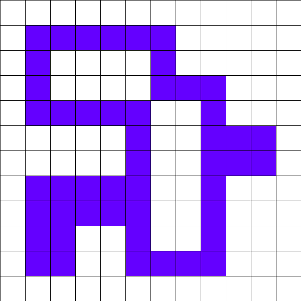
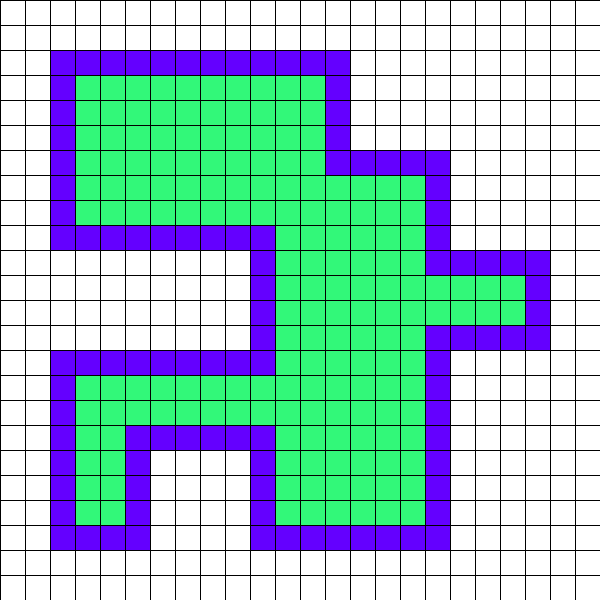
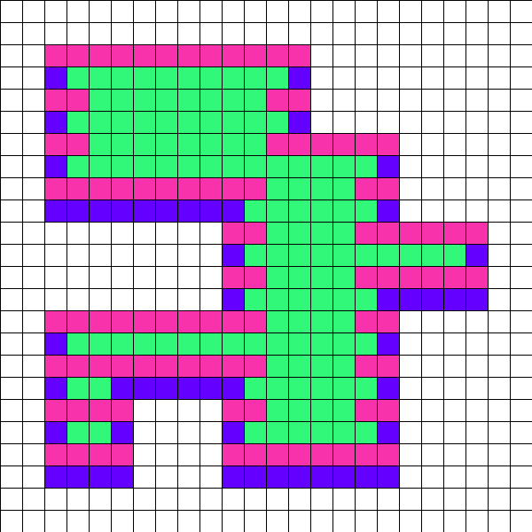
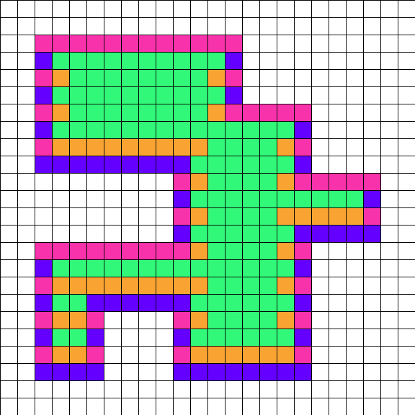
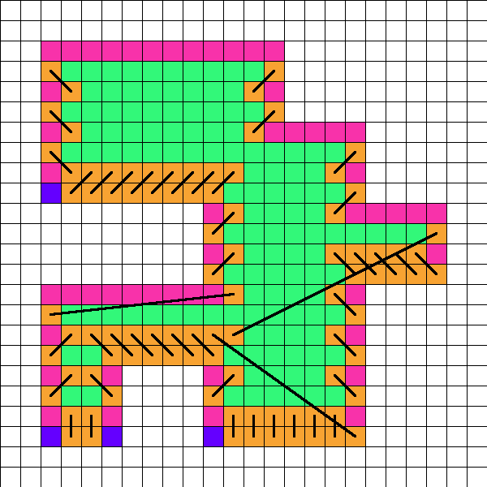
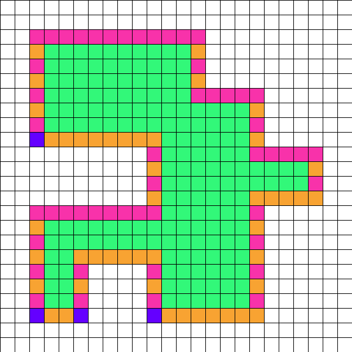

# Day 18: Lavaduct Lagoon

## Part 1

### Prompt

Thanks to your efforts, the machine parts factory is one of the first factories up and running since the lavafall came back.
However, to catch up with the large backlog of parts requests, the factory will also need a **large supply of lava** for a while; the Elves have already started creating a large lagoon nearby for this purpose.

However, they aren't sure the lagoon will be big enough; they've asked you to take a look at the **dig plan** (your puzzle input).
For example:

```
R 6 (#70c710)
D 5 (#0dc571)
L 2 (#5713f0)
D 2 (#d2c081)
R 2 (#59c680)
D 2 (#411b91)
L 5 (#8ceee2)
U 2 (#caa173)
L 1 (#1b58a2)
U 2 (#caa171)
R 2 (#7807d2)
U 3 (#a77fa3)
L 2 (#015232)
U 2 (#7a21e3)
```

The digger starts in a 1 meter cube hole in the ground.
They then dig the specified number of meters **up** (`U`), **down** (`D`), **left** (`L`), or **right** (`R`), clearing full 1 meter cubes as they go.
The directions are given as seen from above, so if "up" were north, then "right" would be east, and so on.
Each trench is also listed with **the color that the edge of the trench should be painted** as an RGB hexadecimal color code.

When viewed from above, the above example dig plan would result in the following loop of **trench** (`#`) having been dug out from otherwise **ground-level terrain** (`.`):

```
#######
#.....#
###...#
..#...#
..#...#
###.###
#...#..
##..###
.#....#
.######
```

At this point, the trench could contain 38 cubic meters of lava.
However, this is just the edge of the lagoon; the next step is to **dig out the interior** so that it is one meter deep as well:

```
#######
#######
#######
..#####
..#####
#######
#####..
#######
.######
.######
```

Now, the lagoon can contain a much more respectable **`62`** cubic meters of lava.
While the interior is dug out, the edges are also painted according to the color codes in the dig plan.

The Elves are concerned the lagoon won't be large enough; if they follow their dig plan, **how many cubic meters of lava could it hold?**

### Solution

Iterate over directions and add each new point to a path, updating the "current" point as we go.

Once we have the path, calculating the enclosed area can be found using the [`np.trapz`](https://numpy.org/doc/stable/reference/generated/numpy.trapz.html) function.
This function doesn't include the permiter, so we have to account for that ourselves.

Wondering why we take `half_permiter` and `+1` into account for the area calculation?
See the [visualization](#visualization) below.

```python
from dataclasses import dataclass

import numpy as np
from fastapi import APIRouter, Body

router = APIRouter(tags=["2023 - Day 18: Lavaduct Lagoon"])


DOCUMENT_EXAMPLE = [
    "R 6 (#70c710)",
    "D 5 (#0dc571)",
    "L 2 (#5713f0)",
    "D 2 (#d2c081)",
    "R 2 (#59c680)",
    "D 2 (#411b91)",
    "L 5 (#8ceee2)",
    "U 2 (#caa173)",
    "L 1 (#1b58a2)",
    "U 2 (#caa171)",
    "R 2 (#7807d2)",
    "U 3 (#a77fa3)",
    "L 2 (#015232)",
    "U 2 (#7a21e3)",
]


@dataclass(frozen=True)
class Coordinate:
    x: int
    y: int

    def __repr__(self) -> str:
        return f"x: {self.x}, y: {self.y}"


OFFSET: dict[str, tuple[int, int]] = {
    "R": (1, 0),
    "L": (-1, 0),
    "U": (0, -1),
    "D": (0, 1),
}


@dataclass
class BigGrid:
    current: Coordinate
    path: list[Coordinate]

    half_perimiter: int = 0

    @property
    def enclosed_area(self) -> int:
        x_coordinates = [position.x for position in self.path[:-1]]
        y_coordinates = [position.y for position in self.path[:-1]]

        # Calculates the area within
        area = abs(np.trapz(y_coordinates, x=x_coordinates))

        return area + self.half_perimiter + 1

    def move(self, x: int, y: int) -> None:
        # One of these is always zero, just add both
        self.half_perimiter += (abs(x) + abs(y)) / 2

        self.current = Coordinate(
            x=self.current.x + x,
            y=self.current.y + y,
        )
        self.path.append(self.current)


@router.post("/part-1")
async def year_2023_day_18_part_1(
    document: list[str] = Body(
        ...,
        embed=True,
        examples=[DOCUMENT_EXAMPLE],
    ),
) -> int:
    grid = BigGrid(
        current=Coordinate(x=0, y=0),
        path=[Coordinate(x=0, y=0)],
    )

    for line in document:
        direction, distance, _ = line.split(" ")

        x_offset, y_offset = OFFSET[direction]
        grid.move(x_offset * int(distance), y_offset * int(distance))

    return grid.enclosed_area
```

## Part 2

### Prompt

The Elves were right to be concerned; the planned lagoon would be **much too small**.

After a few minutes, someone realizes what happened; someone **swapped the color and instruction parameters** when producing the dig plan.
They don't have time to fix the bug; one of them asks if you can **extract the correct instructions** from the hexadecimal codes.

Each hexadecimal code is **six hexadecimal digits** long.
The first five hexadecimal digits encode the **distance in meters** as a five-digit hexadecimal number.
The last hexadecimal digit encodes the** direction to dig**: `0` means `R`, `1` means `D`, `2` means `L`, and `3` means `U`.

So, in the above example, the hexadecimal codes can be converted into the true instructions:

```
#70c710 = R 461937
#0dc571 = D 56407
#5713f0 = R 356671
#d2c081 = D 863240
#59c680 = R 367720
#411b91 = D 266681
#8ceee2 = L 577262
#caa173 = U 829975
#1b58a2 = L 112010
#caa171 = D 829975
#7807d2 = L 491645
#a77fa3 = U 686074
#015232 = L 5411
#7a21e3 = U 500254
```

Digging out this loop and its interior produces a lagoon that can hold an impressive **`952408144115`** cubic meters of lava.

Convert the hexadecimal color codes into the correct instructions; if the Elves follow this new dig plan, **how many cubic meters of lava could the lagoon hold?**

### Solution

Exact same as Part 1, but convert the hex codes into directions.

Wondering why we take `half_permiter` and `+1` into account for the area calculation?
See the [visualization](#visualization) below.

```python
from dataclasses import dataclass

import numpy as np
from fastapi import APIRouter, Body

router = APIRouter(tags=["2023 - Day 18: Lavaduct Lagoon"])


DOCUMENT_EXAMPLE = [
    "R 6 (#70c710)",
    "D 5 (#0dc571)",
    "L 2 (#5713f0)",
    "D 2 (#d2c081)",
    "R 2 (#59c680)",
    "D 2 (#411b91)",
    "L 5 (#8ceee2)",
    "U 2 (#caa173)",
    "L 1 (#1b58a2)",
    "U 2 (#caa171)",
    "R 2 (#7807d2)",
    "U 3 (#a77fa3)",
    "L 2 (#015232)",
    "U 2 (#7a21e3)",
]


@dataclass(frozen=True)
class Coordinate:
    x: int
    y: int

    def __repr__(self) -> str:
        return f"x: {self.x}, y: {self.y}"


OFFSET: dict[str, tuple[int, int]] = {
    "R": (1, 0),
    "L": (-1, 0),
    "U": (0, -1),
    "D": (0, 1),
}


@dataclass
class BigGrid:
    current: Coordinate
    path: list[Coordinate]

    half_perimiter: int = 0

    @property
    def enclosed_area(self) -> int:
        x_coordinates = [position.x for position in self.path[:-1]]
        y_coordinates = [position.y for position in self.path[:-1]]

        # Calculates the area within
        area = abs(np.trapz(y_coordinates, x=x_coordinates))

        return area + self.half_perimiter + 1

    def move(self, x: int, y: int) -> None:
        # One of these is always zero, just add both
        self.half_perimiter += (abs(x) + abs(y)) / 2

        self.current = Coordinate(
            x=self.current.x + x,
            y=self.current.y + y,
        )
        self.path.append(self.current)


@router.post("/part-2")
async def year_2023_day_18_part_2(
    document: list[str] = Body(
        ...,
        embed=True,
        examples=[DOCUMENT_EXAMPLE],
    ),
) -> int:
    grid = BigGrid(
        current=Coordinate(x=0, y=0),
        path=[Coordinate(x=0, y=0)],
    )

    direction_map: dict[str, str] = {
        "0": "R",
        "1": "D",
        "2": "L",
        "3": "U",
    }

    for line in document:
        _, __, color = line.split(" ")

        # Convert from hex to decimal
        distance = int(color[2:7], 16)
        direction = direction_map[color[7]]

        x_offset, y_offset = OFFSET[direction]
        grid.move(x_offset * distance, y_offset * distance)

    return grid.enclosed_area
```

## Recap

| Day | Part 1 Time | Part 1 Rank | Part 2 Time | Part 2 Rank |
|-----|-------------|-------------|-------------|-------------|
| 18  | 00:34:46    | 1,918       | 01:17:50    | 1,583       |

My initial solution for Part 1 was nearly identical to my [Day 10 Pipe Maze](day-10.md) solution.
I used flood-fill to fill up the interior space and I counted the "enclosed" tiles.
This worked for the both the real and example input.

Part 2 has directions that make the path multiple orders of magnitude longer (and the enclosed area multiple orders of magnitude larger).
Flood-fill obviously wouldn't work here.

Wondering why we take `half_permiter` and `+1` into account for the area calculation?
See below.

### Visualization

=== "Step 1"

    Lets say we have this path.
    The top-left tile is `(1, 1)`.
    However, that position `(1, 1)` is in the **center** of the tile.

    <figure markdown>
      
      <figcaption>Example Path</figcaption>
    </figure>

=== "Step 2"

    When we use `np.trapz` to calculate the enclosed area, it's calculating the area using the **center points** of each tile in the path.

    If we divide the grid by 2x in each direction, we can see how the **green** area is enclosed by the **center points** of each path tile.

    <figure markdown>
      
      <figcaption>Example Path w/ Enclosed Area</figcaption>
    </figure>

=== "Step 3"

    However, this misses part of area covered by **the path itself**.
    It looks like ~half of the path is inside of the enclosed area, so we'll start with that.
    
    Let's look at the grid with the **top half** of each path tile highlighted in **pink**.

    <figure markdown>
      
      <figcaption>Example Path w/ Highlighted Half-Tiles</figcaption>
    </figure>

=== "Step 4"

    Many of these sub-tiles are obviously within the **enclosed** area, so let's highlight those in **orange**.

    <figure markdown>
      
      <figcaption>Example Path w/ Highlighted Half-Tiles</figcaption>
    </figure>

=== "Step 5"

    Let's move these sub-tiles to the path, covering sub-tiles that **aren't enclosed**.

    <figure markdown>
      
      <figcaption>Example Path w/ Moved Half-Tiles</figcaption>
    </figure>

=== "Step 6"

    This leaves us with all of the **green** tiles in the **enclosed** section (calculated by `np.trapz`),
    **pink** and **orange** sub-tiles covering **half of the permiter**,
    and **four purple** sub-tiles representing corners that weren't counted.
 
    The **four purple** sub-tiles make a full tile, hence the `+1`.

    !!! note

        We will always end up with **four purple** sub-tiles that weren't counted, regardless of the path.
   
    The final calculation is `np.trapz(...) + half_perimiter + 1`.

    <figure markdown>
      
      <figcaption>Example Path w/ Final Positions</figcaption>
    </figure>
