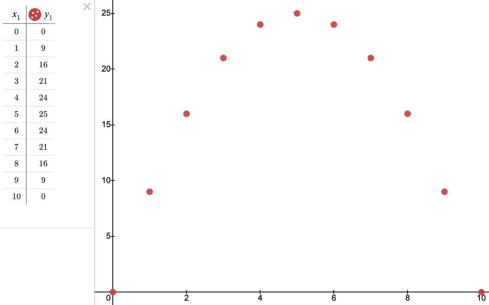
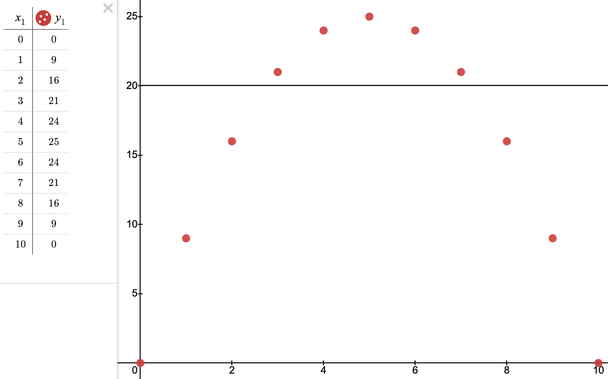

# Day 6: Wait For It

## Part 1

### Prompt

The ferry quickly brings you across Island Island.
After asking around, you discover that there is indeed normally a large pile of sand somewhere near here, but you don't see anything besides lots of water and the small island where the ferry has docked.

As you try to figure out what to do next, you notice a poster on a wall near the ferry dock.
"Boat races! Open to the public! Grand prize is an all-expenses-paid trip to Desert Island!"
That must be where the sand comes from!
Best of all, the boat races are starting in just a few minutes.

You manage to sign up as a competitor in the boat races just in time.
The organizer explains that it's not really a traditional race - instead, you will get a fixed amount of time during which your boat has to travel as far as it can, and you win if your boat goes the farthest.

As part of signing up, you get a sheet of paper (your puzzle input) that lists the **time** allowed for each race and also the best **distance** ever recorded in that race.
To guarantee you win the grand prize, you need to make sure you **go farther in each race** than the current record holder.

The organizer brings you over to the area where the boat races are held.
The boats are much smaller than you expected - they're actually **toy boats**, each with a big button on top.
Holding down the button **charges the boat**, and releasing the button **allows the boat to move**.
Boats move faster if their button was held longer, but time spent holding the button counts against the total race time.
You can only hold the button at the start of the race, and boats don't move until the button is released.

For example:

```
Time:      7  15   30
Distance:  9  40  200
```

This document describes three races:

- The first race lasts 7 milliseconds. The record distance in this race is 9 millimeters.
- The second race lasts 15 milliseconds. The record distance in this race is 40 millimeters.
- The third race lasts 30 milliseconds. The record distance in this race is 200 millimeters.

Your toy boat has a starting speed of **zero millimeters per millisecond**.
For each whole millisecond you spend at the beginning of the race holding down the button, the boat's speed increases by **one millimeter per millisecond**.

So, because the first race lasts 7 milliseconds, you only have a few options:

- Don't hold the button at all (that is, hold it for **`0` milliseconds**) at the start of the race. The boat won't move; it will have traveled **`0` millimeters** by the end of the race.
- Hold the button for **`1` millisecond** at the start of the race. Then, the boat will travel at a speed of 1 millimeter per millisecond for 6 milliseconds, reaching a total distance traveled of **`6` millimeters**.
- Hold the button for **`2` milliseconds**, giving the boat a speed of `2` millimeters per millisecond. It will then get 5 milliseconds to move, reaching a total distance of **`10` millimeters**.
- Hold the button for **`3` milliseconds**. After its remaining `4` milliseconds of travel time, the boat will have gone **`12` millimeters**.
- Hold the button for **`4` milliseconds**. After its remaining `3` milliseconds of travel time, the boat will have gone **`12` millimeters**.
- Hold the button for **`5` milliseconds**, causing the boat to travel a total of **`10` millimeters**.
- Hold the button for **`6` milliseconds**, causing the boat to travel a total of **`6` millimeters**.
- Hold the button for **`7` milliseconds**. That's the entire duration of the race. You never let go of the button. The boat can't move until you let you of the button. Please make sure you let go of the button so the boat gets to move. **`0` millimeters**.

Since the current record for this race is `9` millimeters, there are actually **`4`** different ways you could win: you could hold the button for `2`, `3`, `4`, or `5` milliseconds at the start of the race.

In the second race, you could hold the button for at least `4` milliseconds and at most `11` milliseconds and beat the record, a total of **`8`** different ways to win.

In the third race, you could hold the button for at least `11` milliseconds and no more than `19` milliseconds and still beat the record, a total of **`9`** ways you could win.

To see how much margin of error you have, determine the **number of ways you can beat the record** in each race; in this example, if you multiply these values together, you get **`288`** (`4` * `8` * `9`).

Determine the number of ways you could beat the record in each race.
**What do you get if you multiply these numbers together?**

### Brute-Force Solution

A very simple brute-force solution to the problem.
For each time/distance pair:

1. Iterate over all possible start times
    1. Calculate the final speed
    2. Calculate the remaining time
    3. Calculate the distance covered
    4. If the distance covered is greater than the required distance, increment the number of wins for this time/distance pair
2. Multiply all win counts together using a running total

```python
from fastapi import APIRouter, Body

router = APIRouter(tags=["2023 - Day 6: Wait For It"])


@router.post("/part-1")
async def year_2023_day_6_part_1(
    times: list[int] = Body(
        ...,
        embed=True,
        examples=[[7, 15, 30]],
    ),
    distances: list[int] = Body(
        ...,
        embed=True,
        examples=[[9, 40, 200]],
    ),
) -> int:
    total: int = 1

    for time, distance in zip(times, distances):
        race_wins = 0

        for time_start in range(time):
            speed = time_start
            remaining_time = time - time_start
            covered_distance = speed * remaining_time

            if covered_distance > distance:
                race_wins += 1

        total *= race_wins

    return total
```

## Part 2

### Prompt

As the race is about to start, you realize the piece of paper with race times and record distances you got earlier actually just has very bad kerning.
There's really **only one race** - ignore the spaces between the numbers on each line.

So, the example from before:

```
Time:      7  15   30
Distance:  9  40  200
```

...now instead means this:

```
Time:      71530
Distance:  940200
```

Now, you have to figure out how many ways there are to win this single race.
In this example, the race lasts for **`71530` milliseconds** and the record distance you need to beat is **`940200` millimeters**.
You could hold the button anywhere from `14` to `71516` milliseconds and beat the record, a total of **`71503`** ways!

**How many ways can you beat the record in this one much longer race?**

### Brute-Force Solution

Just a simplified version of the Part 1 solution, accepting only one time and distance.

```python
from fastapi import APIRouter, Body

router = APIRouter(tags=["2023 - Day 6: Wait For It"])


@router.post("/part-2")
async def year_2023_day_6_part_2(
    time: int = Body(
        ...,
        embed=True,
        examples=[71530],
    ),
    distance: int = Body(
        ...,
        embed=True,
        examples=[940200],
    ),
) -> int:
    race_wins = 0

    for time_start in range(time):
        speed = time_start
        remaining_time = time - time_start
        covered_distance = speed * remaining_time

        if covered_distance > distance:
            race_wins += 1

    return race_wins
```

## Recap

| Day | Part 1 Time | Part 1 Rank | Part 2 Time | Part 2 Rank |
|-----|-------------|-------------|-------------|-------------|
| 6   | 00:09:44    | 2,544       | 00:11:33    | 1,636       |

This was extremely easy, especially compared to the [insanely difficult day 5](day-5.md) problem.

I went with a brute-force solution, which (thankfully) completed in a reasonable amount of time for Part 2 (~6 seconds).
I really thought I would need to optimize this to get the solution, so maybe I was just lucky with a relatively small input value (`47,986,698`).

### Optimized Solution (Proof)

The calculation to obtain the `covered distance` for a given start time can be simplified greatly.

---

**Given**

$$
\text{speed} = \text{start time}
$$

$$
\text{remaining time} = \text{total time} - \text{start time}
$$

$$
\text{covered distance} = \text{speed} * \text{remaining time}
$$

---

**Substitute**

$$
\text{covered distance} = \text{start time} * (\text{total time} - \text{start time})
$$

---

**Distribute**

$$
\text{covered distance} = (\text{total time} * \text{start time}) - \text{start time}^2
$$

---

We know the `start time` ranges from `0` to `time`.
If we treat `start time` as the x-axis and `covered distance` as the y-axis, we can see the points form a parabola.

=== "0"
    
    $$
    0 = (10 * 0) - 0^2
    $$

=== "1"
    
    $$
    9 = (10 * 1) - 1^2
    $$

=== "2"
    
    $$
    16 = (10 * 2) - 2^2
    $$

=== "3"
    
    $$
    21 = (10 * 3) - 3^2
    $$

=== "4"
    
    $$
    24 = (10 * 4) - 4^2
    $$

=== "5"
    
    $$
    25 = (10 * 5) - 5^2
    $$

=== "6"
    
    $$
    24 = (10 * 6) - 6^2
    $$

=== "7"
    
    $$
    21 = (10 * 7) - 7^2
    $$

=== "8"
    
    $$
    16 = (10 * 8) - 8^2
    $$

=== "9"
    
    $$
    9 = (10 * 9) - 9^2
    $$

=== "10"
    
    $$
    0 = (10 * 10) - 10^2
    $$

<figure markdown>
  { width="600" }
  <figcaption>Parabola from points using <a href="https://www.desmos.com/calculator">Desmos</a></figcaption>
</figure>

We want to find what points on the x-axis result in points on the y-axis above a certain value.
If we use this formula:

$$
\text{covered distance} = (\text{total time} * \text{start time}) - \text{start time}^2
$$

We can plug in the provided distance for `covered distance`, the provided time for `total time`, and solve for `start time`.

In our example above, let's find all `start time`(s) that result in `covered distance` greater than a provided distance of `20`.

- `covered distance` = `20`
- `total time` = `10`

$$
20 = (10 * \text{start time}) - \text{start time}^2
$$

$$
0 = (10 * \text{start time}) - \text{start time}^2 - 20
$$

$$
0 = -\text{start time}^2 + (10 * \text{start time})  - 20
$$

We can then use the quadratic equation to solve for the roots.

$$
x = {-b \pm \sqrt{b^2-4ac} \over 2a}
$$


- `a` = `-1`
- `b` = `10`
- `c` = `-20`

$$
x = {-10 \pm \sqrt{10^2-4*-1*-20} \over 2 * -1}
$$

$$
x = {-10 \pm \sqrt{100-80} \over -2}
$$

$$
x = {-10 \pm \sqrt{20} \over -2}
$$

$$
x = {-10 \over -2} \pm {\sqrt{20} \over -2}
$$

$$
x = {-10 \over -2} \pm {\sqrt{5*4} \over -2}
$$

$$
x = {-10 \over -2} \pm {2 * \sqrt{5} \over -2}
$$

$$
x = {-10 \over -2} \pm \sqrt{5}
$$

$$
x = 5 \pm \sqrt{5}
$$

$$
x = 2.764, 7.236
$$

**What does this mean?**

If we wait for more than **`2.764` milliseconds** but less than **`7.236` milliseconds**, our boat will have enough speed to cross the required **20 millimeter** distance.

We simply add `1` the lower value and round it down (`2.764` to `3`) and subtract `1` from the upper value and round it up (`7.236` to `7`), and count the integers between them (inclusive).

This addition/subtraction *before* rounding covers cases when our `covered distance` exactly matches our `distance`, which we want to avoid including (`covered distance` needs to *beat* `distance`).

For our example, these values are `3`, `4`, `5`, `6`, and `7`.
If we look at an annotated version of the earlier graph, we can trivially see that these points along the x-axis result in a y-axis value above `20`.

<figure markdown>
  { width="600" }
  <figcaption>Annotated parabola from points using <a href="https://www.desmos.com/calculator">Desmos</a></figcaption>
</figure>

### Optimized Solution (Code)

```python
import math

from fastapi import APIRouter, Body

router = APIRouter(tags=["2023 - Day 6: Wait For It"])


@router.post("/part-1")
async def year_2023_day_6_part_1(
    times: list[int] = Body(
        ...,
        embed=True,
        examples=[[7, 15, 30]],
    ),
    distances: list[int] = Body(
        ...,
        embed=True,
        examples=[[9, 40, 200]],
    ),
) -> int:
    total: int = 1

    for time, distance in zip(times, distances):
        minimum_time = math.floor((-time + math.sqrt(time ** 2 - 4 * -1 * -distance)) / -2 + 1)
        maximum_time = math.ceil((-time - math.sqrt(time ** 2 - 4 * -1 * -distance)) / -2 - 1)

        total *= (maximum_time - minimum_time + 1)

    return total


@router.post("/part-2")
async def year_2023_day_6_part_2(
    time: int = Body(
        ...,
        embed=True,
        examples=[71530],
    ),
    distance: int = Body(
        ...,
        embed=True,
        examples=[940200],
    ),
) -> int:
    minimum_time = math.floor((-time + math.sqrt(time**2 - 4 * -1 * -distance)) / -2 + 1)
    maximum_time = math.ceil((-time - math.sqrt(time**2 - 4 * -1 * -distance)) / -2 - 1)

    return maximum_time - minimum_time + 1
```

### Comparison

This test uses my real Advent of Code input.

```python
import pytest


@pytest.mark.parametrize(
    "time,distance,output",
    [
        (47986698, 400121310111540, 26499773),
    ],
)
def test_part_2(time: int, distance: int, output: int, test_client: TestClient) -> None:
    response = test_client.post(
        "2023/day-6/part-2",
        json={
            "time": time,
            "distance": distance,
        },
    )

    assert response.status_code == 200
    assert response.json() == output
```

#### Brute-Force Solution

```
====================================================== test session starts ======================================================
platform darwin -- Python 3.12.0, pytest-7.4.3, pluggy-1.3.0
rootdir: /Users/fletchereaston/Documents/GitHub/Experiments/advent-of-code
configfile: pyproject.toml
plugins: cov-4.1.0, anyio-3.7.1
collected 1 item

tests/year_2023/day_6/test.py .

======================================================= 1 passed in 6.37s =======================================================
```

#### Optimized Solution

```
====================================================== test session starts ======================================================
platform darwin -- Python 3.12.0, pytest-7.4.3, pluggy-1.3.0
rootdir: /Users/fletchereaston/Documents/GitHub/Experiments/advent-of-code
configfile: pyproject.toml
plugins: cov-4.1.0, anyio-3.7.1
collected 1 item

tests/year_2023/day_6/test.py .

======================================================= 1 passed in 0.02s =======================================================
```
